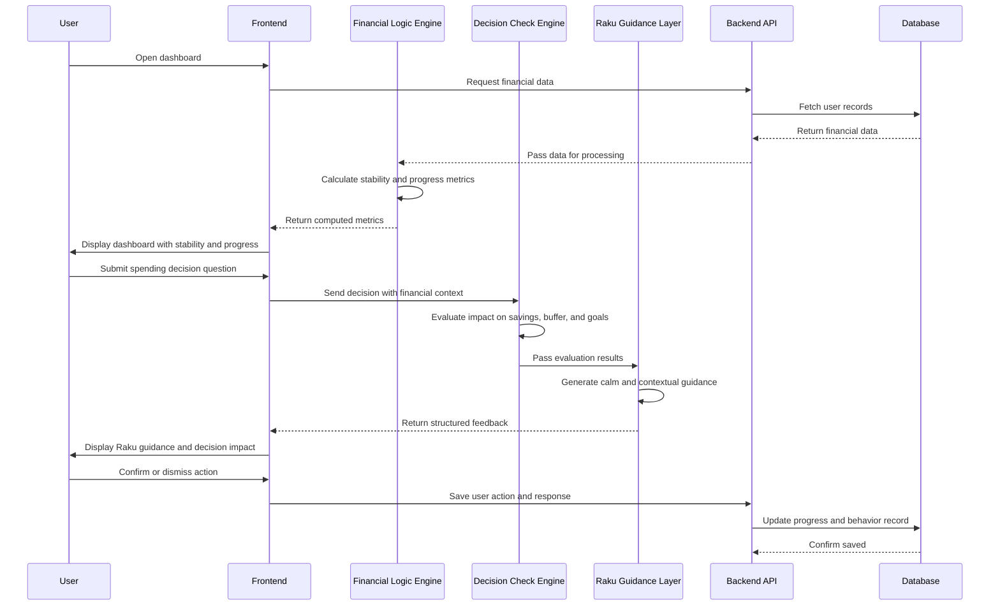

# Sequence Diagram

```mermaid
sequenceDiagram
    participant User
    participant Frontend
    participant Financial Logic Engine
    participant Decision Check Engine
    participant Raku Guidance Layer
    participant Backend API
    participant Database

    User->>Frontend: Open dashboard
    Frontend->>Backend API: Request financial data
    Backend API->>Database: Fetch user records
    Database-->>Backend API: Return financial data
    Backend API-->>Financial Logic Engine: Pass data for processing
    Financial Logic Engine->>Financial Logic Engine: Calculate stability and progress metrics
    Financial Logic Engine-->>Frontend: Return computed metrics
    Frontend->>User: Display dashboard with stability and progress

    User->>Frontend: Submit spending decision question
    Frontend->>Decision Check Engine: Send decision with financial context
    Decision Check Engine->>Decision Check Engine: Evaluate impact on savings, buffer, and goals
    Decision Check Engine->>Raku Guidance Layer: Pass evaluation results
    Raku Guidance Layer->>Raku Guidance Layer: Generate calm and contextual guidance
    Raku Guidance Layer-->>Frontend: Return structured feedback
    Frontend->>User: Display Raku guidance and decision impact

    User->>Frontend: Confirm or dismiss action
    Frontend->>Backend API: Save user action and response
    Backend API->>Database: Update progress and behavior record
    Database-->>Backend API: Confirm saved
```