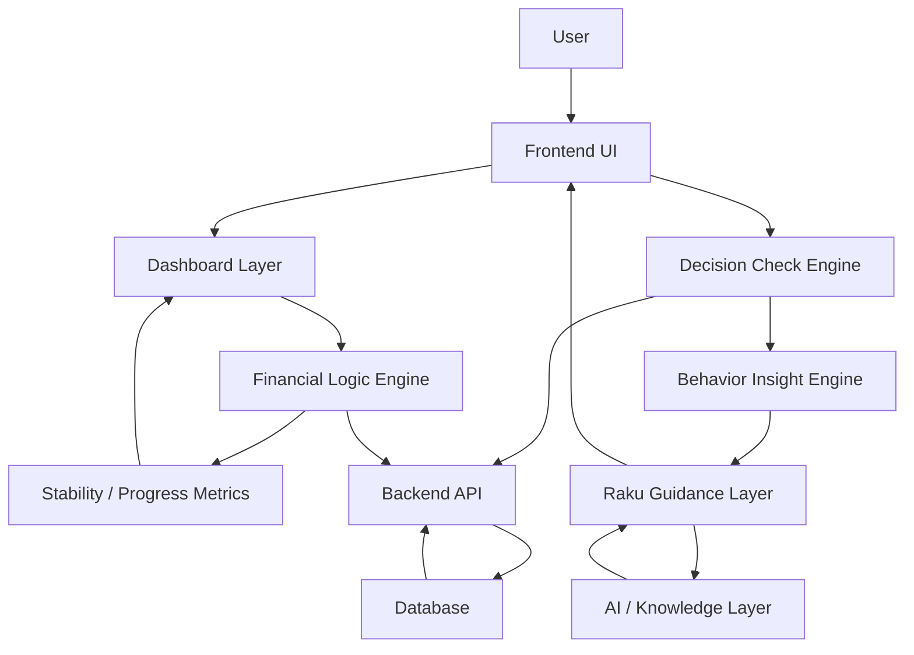

# System Diagram

```mermaid
graph TD
    A[User] --> B[Frontend UI]
    B --> C[Dashboard Layer]
    C --> D[Financial Logic Engine]
    D --> E[Stability / Progress Metrics]
    E --> C
    B --> F[Decision Check Engine]
    F --> G[Behavior Insight Engine]
    G --> H[Raku Guidance Layer]
    H --> I[AI / Knowledge Layer]
    I --> H
    H --> B
    F --> J[Backend API]
    D --> J
    J --> K[Database]
    K --> J
```