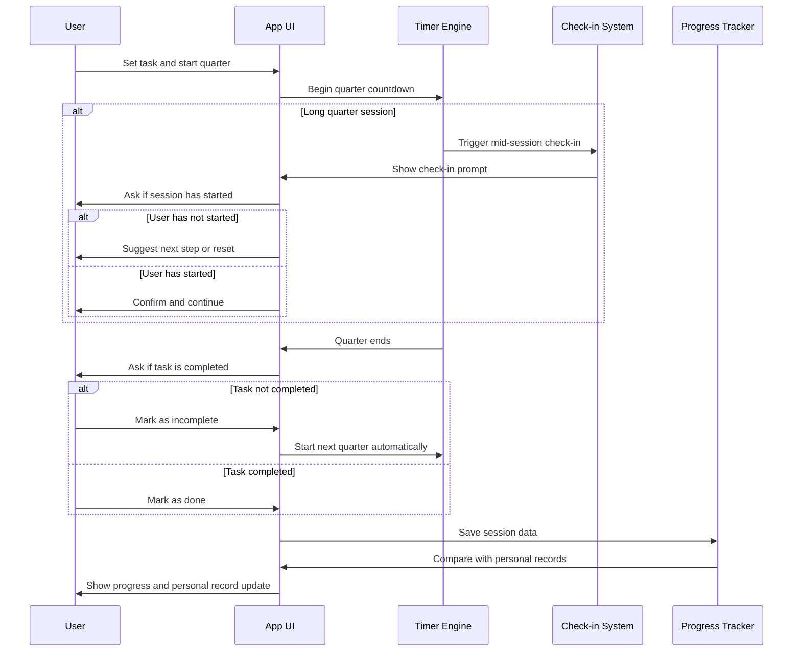

# Sequence Diagram

```mermaid
sequenceDiagram
    participant User
    participant App UI
    participant Timer Engine
    participant Check-in System
    participant Progress Tracker

    User->>App UI: Set task and start quarter
    App UI->>Timer Engine: Begin quarter countdown

    alt Long quarter session
        Timer Engine->>Check-in System: Trigger mid-session check-in
        Check-in System->>App UI: Show check-in prompt
        App UI->>User: Ask if session has started

        alt User has not started
            App UI->>User: Suggest next step or reset
        else User has started
            App UI->>User: Confirm and continue
        end
    end

    Timer Engine->>App UI: Quarter ends
    App UI->>User: Ask if task is completed

    alt Task not completed
        User->>App UI: Mark as incomplete
        App UI->>Timer Engine: Start next quarter automatically
    else Task completed
        User->>App UI: Mark as done
    end

    App UI->>Progress Tracker: Save session data
    Progress Tracker->>App UI: Compare with personal records
    App UI->>User: Show progress and personal record update
```