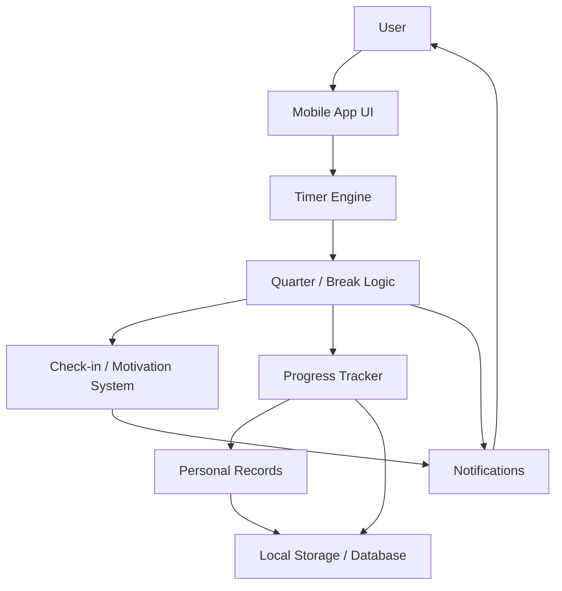

# System Diagram

```mermaid
graph TD
    A[User] --> B[Mobile App UI]
    B --> C[Timer Engine]
    C --> D[Quarter / Break Logic]
    D --> E[Check-in / Motivation System]
    D --> F[Progress Tracker]
    F --> G[Personal Records]
    F --> H[Local Storage / Database]
    G --> H
    E --> I[Notifications]
    I --> A
    D --> I
```