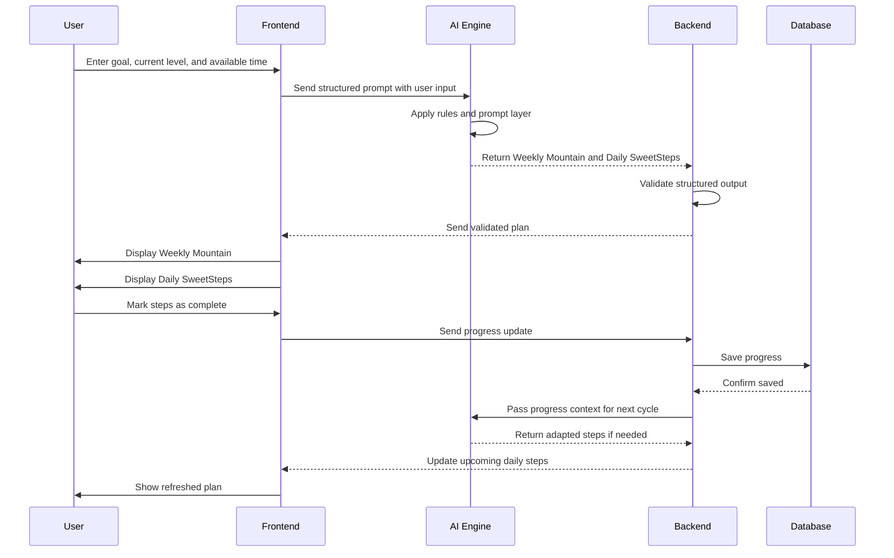

# Sequence Diagram

```mermaid
sequenceDiagram
    participant User
    participant Frontend
    participant AI Engine
    participant Backend
    participant Database

    User->>Frontend: Enter goal, current level, and available time
    Frontend->>AI Engine: Send structured prompt with user input
    AI Engine->>AI Engine: Apply rules and prompt layer
    AI Engine-->>Backend: Return Weekly Mountain and Daily SweetSteps
    Backend->>Backend: Validate structured output
    Backend-->>Frontend: Send validated plan

    Frontend->>User: Display Weekly Mountain
    Frontend->>User: Display Daily SweetSteps

    User->>Frontend: Mark steps as complete
    Frontend->>Backend: Send progress update
    Backend->>Database: Save progress
    Database-->>Backend: Confirm saved

    Backend->>AI Engine: Pass progress context for next cycle
    AI Engine-->>Backend: Return adapted steps if needed
    Backend-->>Frontend: Update upcoming daily steps
    Frontend->>User: Show refreshed plan
```