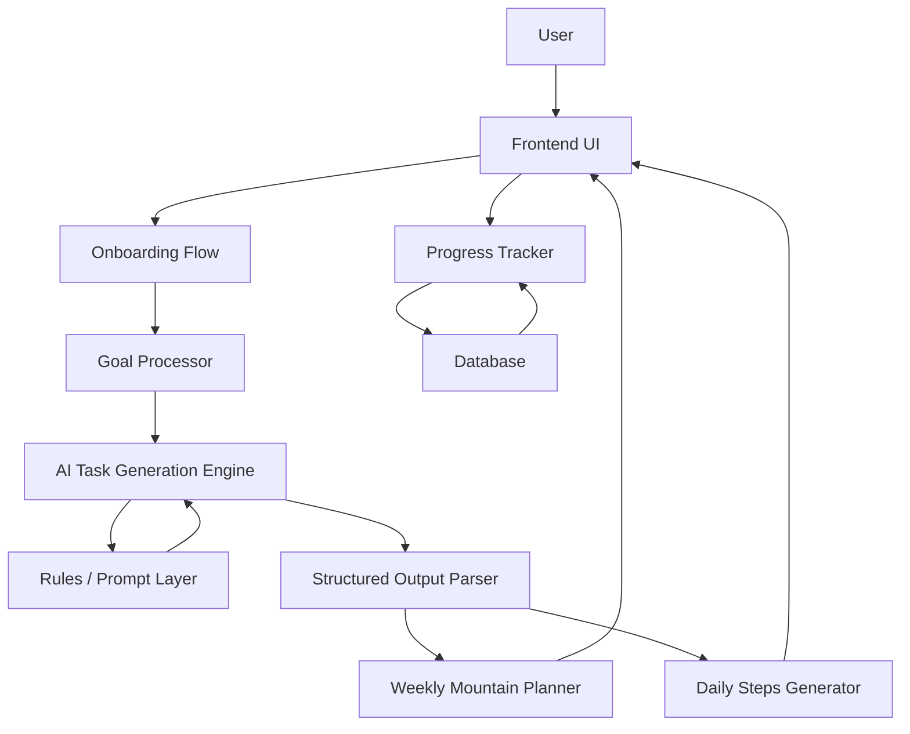

# System Diagram

```mermaid
graph TD
    A[User] --> B[Frontend UI]
    B --> C[Onboarding Flow]
    C --> D[Goal Processor]
    D --> E[AI Task Generation Engine]
    E --> F[Rules / Prompt Layer]
    F --> E
    E --> G[Structured Output Parser]
    G --> H[Weekly Mountain Planner]
    G --> I[Daily Steps Generator]
    H --> B
    I --> B
    B --> J[Progress Tracker]
    J --> K[Database]
    K --> J
```