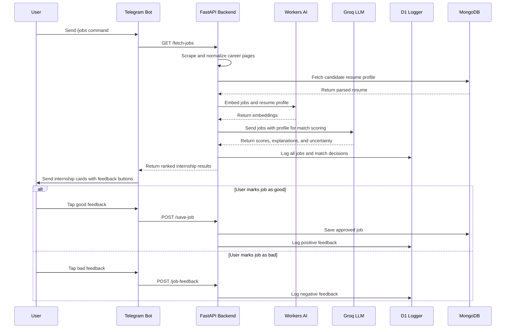

# Sequence Diagram

```mermaid
sequenceDiagram
    participant User
    participant Telegram Bot
    participant FastAPI Backend
    participant Workers AI
    participant Groq LLM
    participant D1 Logger
    participant MongoDB

    User->>Telegram Bot: Send /jobs command
    Telegram Bot->>FastAPI Backend: GET /fetch-jobs

    FastAPI Backend->>FastAPI Backend: Scrape and normalize career pages
    FastAPI Backend->>MongoDB: Fetch candidate resume profile
    MongoDB-->>FastAPI Backend: Return parsed resume

    FastAPI Backend->>Workers AI: Embed jobs and resume profile
    Workers AI-->>FastAPI Backend: Return embeddings

    FastAPI Backend->>Groq LLM: Send jobs with profile for match scoring
    Groq LLM-->>FastAPI Backend: Return scores, explanations, and uncertainty

    FastAPI Backend->>D1 Logger: Log all jobs and match decisions
    FastAPI Backend-->>Telegram Bot: Return ranked internship results

    Telegram Bot->>User: Send internship cards with feedback buttons

    alt User marks job as good
        User->>Telegram Bot: Tap good feedback
        Telegram Bot->>FastAPI Backend: POST /save-job
        FastAPI Backend->>MongoDB: Save approved job
        FastAPI Backend->>D1 Logger: Log positive feedback
    else User marks job as bad
        User->>Telegram Bot: Tap bad feedback
        Telegram Bot->>FastAPI Backend: POST /job-feedback
        FastAPI Backend->>D1 Logger: Log negative feedback
    end
```