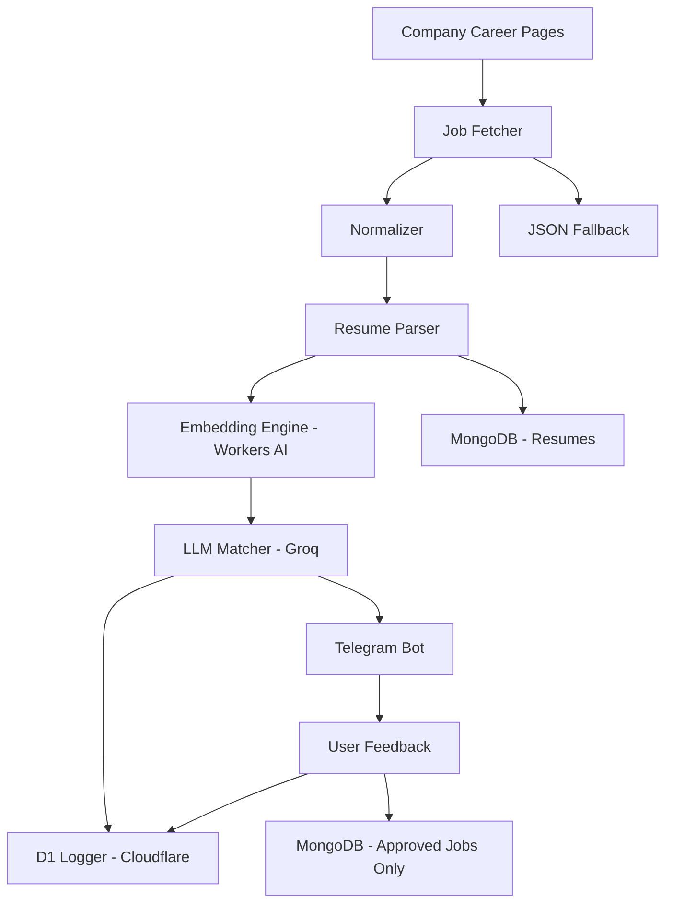

# System Diagram

```mermaid
graph TD
    A[Company Career Pages] --> B[Job Fetcher]
    B --> C[Normalizer]
    C --> D[Resume Parser]
    D --> E[Embedding Engine - Workers AI]
    E --> F[LLM Matcher - Groq]
    F --> G[Telegram Bot]
    F --> H[D1 Logger - Cloudflare]
    G --> I[User Feedback]
    I --> H
    I --> J[MongoDB - Approved Jobs Only]
    D --> K[MongoDB - Resumes]
    B --> L[JSON Fallback]
```