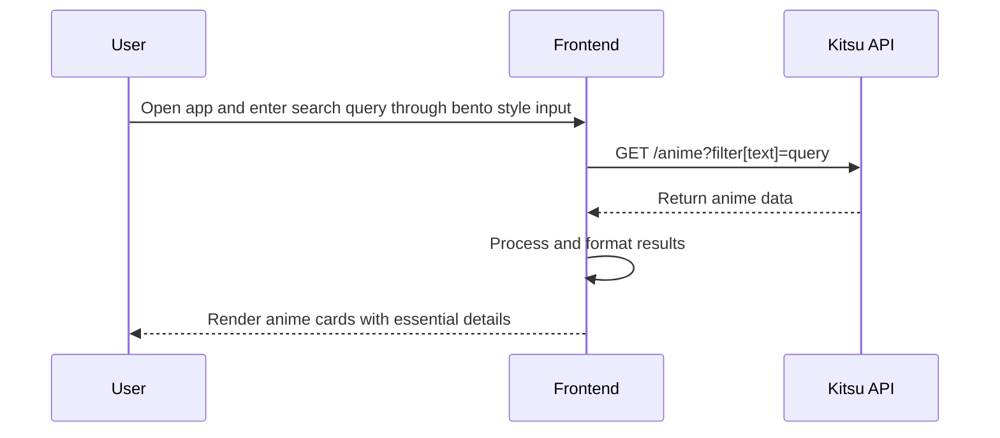

# Sequence Diagram

```mermaid
sequenceDiagram
    participant User
    participant Frontend
    participant Kitsu API

    User->>Frontend: Open app and enter search query through bento style input
    Frontend->>Kitsu API: GET /anime?filter[text]=query
    Kitsu API-->>Frontend: Return anime data
    Frontend->>Frontend: Process and format results
    Frontend-->>User: Render anime cards with essential details
```